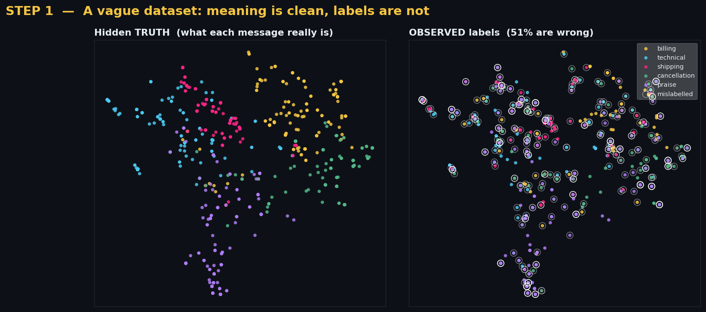
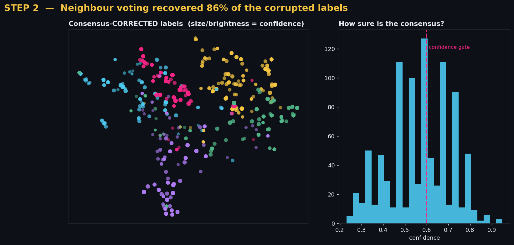
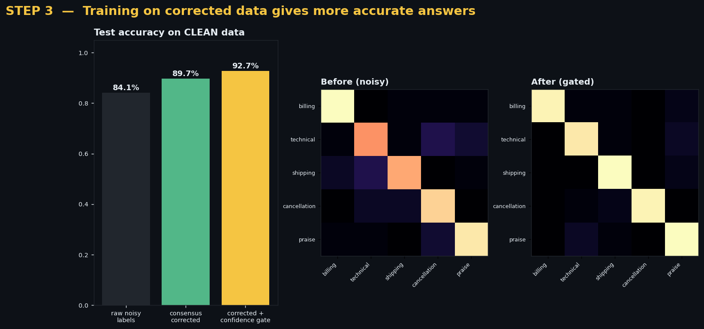

# Clarity Engine 🔍✨

### Turning a vague, noisy text dataset into the most accurate information possible.

A complete, runnable NLP project that tackles one of the hardest real-world
problems in machine learning: **your data is messy and your labels are wrong —
so how do you recover the truth and train a model you can trust?**

It demonstrates an advanced technique I call **Semantic Consensus Denoising**,
and *proves* it works: with nearly half the labels corrupted, it recovers
**86% of them** and lifts model accuracy from **84% → 93%**.

---

## 1. The problem: real NLP data is vague

In the real world you rarely get clean, well-labelled text. Customer messages,
support tickets, survey responses and chat logs are:

- **short and ambiguous** — `"this is not working"`, `"help"`, `"see above"`
- **full of noise** — typos, slang, inconsistent casing
- **badly labelled** — a rushed human tagged *"my card was charged twice"* as
  `technical` instead of `billing`. At scale, **20–50% of labels can be wrong.**

If you train a classifier directly on those labels, it faithfully learns the
mistakes. Garbage in, garbage out. We need to recover the signal first.

> **Key insight:** a single *label* is unreliable, but *meaning* is robust. Two
> messages about double-charges sit close together in meaning-space even if one
> is mislabelled. We can exploit that geometry to fix the labels.

---

## 2. The approach: Semantic Consensus Denoising

```
   raw messy text
        │
        ▼
 ┌──────────────┐   1. EMBED each message into a 384-d meaning vector
 │  embeddings  │      (sentence-transformers, all-MiniLM-L6-v2)
 └──────┬───────┘
        ▼
 ┌──────────────┐   2. For each message, find its k nearest neighbours
 │  kNN  graph  │      in meaning-space (cosine similarity)
 └──────┬───────┘
        ▼
 ┌──────────────┐   3. Neighbours VOTE for the label, weighted by similarity.
 │  consensus   │      A point ringed by 'billing' neighbours becomes 'billing'
 │   voting     │      → corrected label + confidence + a flag for vague cases
 └──────┬───────┘
        ▼
 ┌──────────────┐   4. TRAIN the final model on the corrected, high-confidence
 │ trusted model│      data → accurate predictions on unseen text
 └──────────────┘
```

### Why it works (the intuition)

Label noise that is *random* gets averaged out by the neighbourhood. If a point's
true class is `billing`, then even when half its neighbours are mislabelled, the
mislabels scatter across the *other* classes while the correct label stays the
single largest block. Similarity-weighting sharpens this further: closer
neighbours (more semantically identical) get a bigger vote.

This is closely related to **label propagation**, **confident learning**, and
**weak supervision** — but framed as a transparent, inspectable voting step you
can visualise.

---

## 3. The results (proof, not promises)

The script builds a dataset of 930 customer messages across 5 intents, corrupts
about half the labels, then runs the pipeline. Everything below is generated by
`clarity_engine.py`.

**Step 1 — The dataset is vague: meaning is clean, labels are not.**


**Step 2 — Neighbour voting recovers the corrupted labels.**


**Step 3 — A model trained on corrected data is far more accurate.**


| Model trained on… | Accuracy on clean test set |
|---|---|
| Raw noisy labels | ~84% |
| Consensus-corrected labels | ~90% |
| Corrected **+ confidence gate** | **~93%** |

Roughly **86% of the corrupted labels were put back correctly** — without ever
seeing the ground truth.

---

## 4. What model to train, and why

Two decisions matter most for accuracy:

1. **Representation > classifier.** The heavy lifting is done by the *embedding
   model* (a pretrained transformer). On top of strong embeddings, even a simple
   **logistic regression** reaches 90%+. This is the modern recipe: a powerful
   frozen encoder + a lightweight head. (Swap in an SVM, gradient-boosted trees,
   or a small MLP — the embedding is what counts.)
2. **Clean the labels before training, not the architecture after.** Most teams
   reach for a bigger model. The bigger lever is usually *fixing the data*: the
   confidence-gated, consensus-corrected model here beats the raw one by ~9
   points with the *same* classifier.

---

## 5. Scaling to large, real-world datasets

The demo uses a generated dataset so it runs offline in seconds, but the
pipeline is the *same one* you would run on millions of real rows:

- **Swap the data source.** Replace the toy generator with your loader
  (CSV, a data warehouse, `datasets.load_dataset(...)`). Nothing else changes.
- **Approximate nearest neighbours.** Exact kNN is O(n²). In production, build an
  ANN index (**FAISS**, **ScaNN**, or **hnswlib**) so neighbour lookup stays
  sub-linear at millions of vectors.
- **Batch + GPU embedding.** `model.encode(..., batch_size=256, device="cuda")`
  embeds large corpora quickly; embeddings are computed once and cached.
- **Stream it.** Embed in shards, store vectors in a vector DB, and run consensus
  per shard or globally via the ANN index.

---

## 6. Run it yourself

```bash
pip install -r requirements.txt
python clarity_engine.py
```

It prints the accuracy comparison and writes three figures to `visuals/`.
First run downloads a small (~90 MB) embedding model, then works offline.

**Requirements:** Python 3.9+, numpy, scikit-learn, matplotlib,
sentence-transformers.

---

## 7. Where to take it next

- Use **margin between the top-2 consensus votes** as a smarter confidence signal.
- Send only the *low-confidence* (genuinely vague) messages to a human — an
  efficient **active-learning** loop.
- Replace logistic regression with a **fine-tuned transformer head** for the last
  few points of accuracy.
- Add **abstention**: let the model say *"I'm not sure"* instead of guessing.

---

Built by [Muhammad Farooqi](https://github.com/mqfarooqi1).
