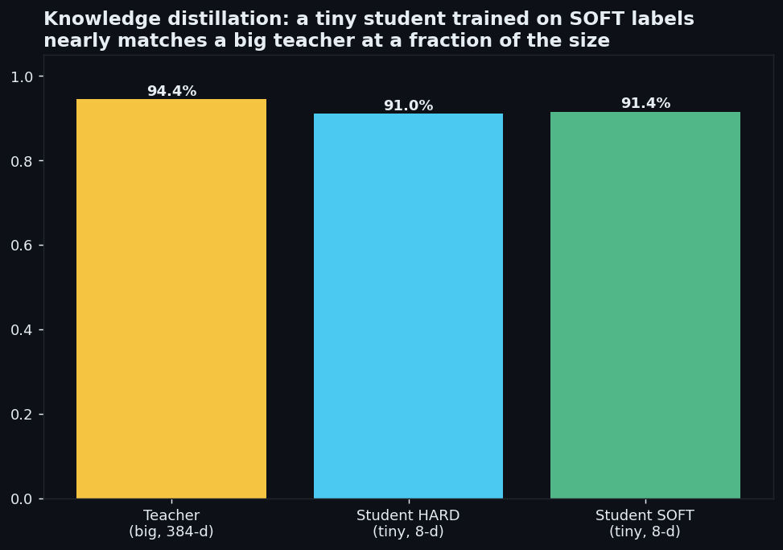
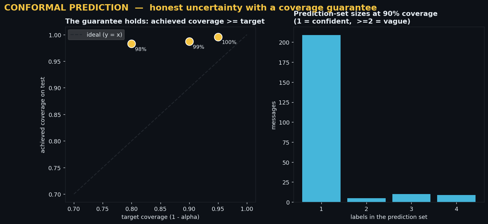

# clarity-engine

A weekend project on a problem I keep running into at work: you're handed a pile
of text with labels, and a good chunk of the labels are wrong. Before you train
anything, it's worth trying to clean them up. This repo is me working through a
few approaches end to end and seeing how far each one actually gets.

Everything here runs on a **synthetic** dataset I generate in-process, so the
numbers below are best read as "this is the shape of the effect," not as
production benchmarks. Real label noise is rarely as well-behaved as the uniform
random corruption I inject here.

## What's in here

| Script | What it does | Needs an API key? |
|---|---|---|
| `clarity_engine.py` | k-NN label correction, then trains a classifier on the cleaned labels | no |
| `distill_demo.py` | toy knowledge-distillation: big model labels data, tiny model imitates it | no |
| `conformal_demo.py` | conformal prediction — returns label *sets* with a coverage guarantee | no |
| `llm_denoise.py` | uses an LLM (Claude) to relabel only the genuinely ambiguous cases | yes |
| `ADVANCED.md` | notes on how these pieces fit together and what I'd do at scale | — |

## The setup

The generator makes ~930 short "customer messages" across 5 intents (billing,
technical, shipping, cancellation, praise), adds the kind of mess real text has
(typos, lowercasing, padding, some genuinely vague one-word messages), and then
**flips ~45% of the labels to random other classes** to simulate sloppy
annotation. I keep a clean held-out test set to score against.

The core idea is unremarkable and that's fine: a single label is noisy, but
*meaning* is more stable. Two messages about double-charges land near each other
in embedding space even if one is mislabelled, so you can use a message's
neighbours to second-guess its label.

## Label cleaning: similarity-weighted k-NN voting

`clarity_engine.py` embeds every message with `all-MiniLM-L6-v2`, finds each
message's nearest neighbours by cosine similarity, and lets them vote on the
label (weighted by similarity). This is basically label propagation / a soft
k-NN smoother — nothing novel, but it's easy to inspect and it works because
random noise scatters across classes while the true class stays the plurality.

What I saw on this synthetic data (≈45% of labels corrupted):

| Trained on | Accuracy on the clean test set |
|---|---|
| the raw noisy labels | ~84% |
| consensus-corrected labels | ~90% |
| corrected + dropping low-confidence rows | ~93% |

About 86% of the corrupted labels got flipped back to the right class without
ever seeing ground truth. Two caveats worth stating plainly:

- Logistic regression on these embeddings is already fairly noise-robust, so the
  raw baseline is higher than you'd expect. The gain from cleaning is real but
  modest, and it would look different under non-random (systematic) noise.
- The confidence "gate" helps partly by throwing away hard examples, which is
  cheating a little if your real goal is coverage. Worth measuring both ways.


## On the model choice

Two things mattered more than the classifier itself:

1. The embedding does the heavy lifting. A frozen sentence-transformer + a plain
   logistic-regression head gets you most of the way; swapping the head for an
   SVM or small MLP barely moves it.
2. Fixing the labels was a bigger lever than changing the model. Same classifier,
   cleaner labels, ~9 points.

## The other three scripts (smaller experiments)

These are short demos of standard techniques, included because the "clean the
labels, then decide what to train" story naturally leads into them. None of them
is doing anything novel.

**`distill_demo.py` — knowledge distillation.** A larger model (full 384-d
embeddings) acts as a teacher and labels data with soft probabilities; a tiny
linear student (8-d input, ~45 params) trains to imitate it. The student recovers
~97% of the teacher's accuracy at a fraction of the size. The textbook claim that
*soft* labels beat *hard* labels only showed up for me once the student was small
enough to be capacity-limited — on the easy, separable version the two were
indistinguishable. So: real effect, but smaller and more situational than the
distillation literature might lead you to expect.



**`conformal_demo.py` — conformal prediction.** Instead of one label, it returns
a *set* with a coverage guarantee (the true label lands in the set at least
~90% of the time). Confident messages get a single label; the genuinely vague
ones ("ok", "?") expand to several — which is the honest answer. I used
randomised APS; plain APS over-covered badly and produced bloated sets on this
data. Note the coverage runs a bit above target because the base model is
accurate enough that even small sets cover well.



**`llm_denoise.py` — LLM relabelling.** For the cases k-NN voting can't resolve,
this sends the message (plus its noisy neighbours as context) to Claude and asks
for a label with a confidence and an explicit "uncertain" option, using
structured outputs so the result is always one of the known classes. The point
isn't to relabel everything with an LLM — that's slow and expensive — but to
spend it only on the residual the cheap method leaves behind. Requires
`ANTHROPIC_API_KEY`; without one it just prints what it would do.

## Running it

```bash
pip install -r requirements.txt

python clarity_engine.py     # label cleaning + training, writes figures to visuals/
python distill_demo.py       # teacher -> student distillation
python conformal_demo.py     # conformal prediction sets

# optional, needs a key:
export ANTHROPIC_API_KEY=...        # PowerShell: $env:ANTHROPIC_API_KEY="..."
python llm_denoise.py
```

First run downloads the ~90 MB embedding model, then everything is offline except
the LLM script.

Requirements: Python 3.9+, numpy, scikit-learn, matplotlib, sentence-transformers,
and (for the LLM script) anthropic + pydantic.

## What I'd do differently for real data

- Use a real labelled sample as ground truth instead of synthetic corruption —
  the whole thing is only as honest as the noise model.
- Swap exact k-NN for an ANN index (FAISS/hnswlib) once you're past ~100k rows.
- Cross-check the k-NN cleaning against confident learning (`cleanlab`); trust the
  rows where both agree, send the disagreements to review or the LLM.
- Actually measure calibration (ECE), not just accuracy, before trusting any
  confidence score.

See `ADVANCED.md` for the longer version of these notes.

---

Muhammad Farooqi · https://github.com/mqfarooqi1
